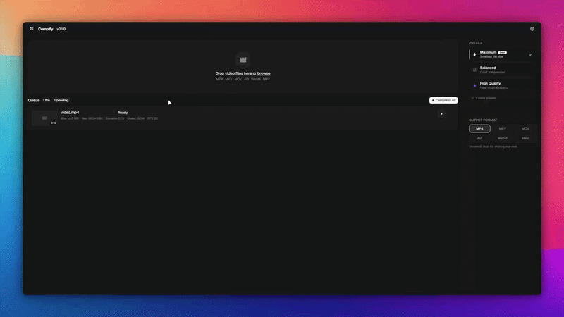

# Compify

**Free, open-source video compressor for Windows, macOS, and Linux.**

Built with [Tauri v2](https://tauri.app), React 19, and Rust — smart presets, GPU acceleration, batch processing, and zero uploads. Your videos never leave your machine.



---

## Download

| Platform | Installer | Portable |
|----------|-----------|----------|
| **Windows** | [Setup (.exe)](https://github.com/taymakz/compify/releases/latest) | [Portable (.exe)](https://github.com/taymakz/compify/releases/latest) |
| **macOS** | [Universal DMG](https://github.com/taymakz/compify/releases/latest) | [Portable (.zip)](https://github.com/taymakz/compify/releases/latest) |
| **Linux** | [AppImage](https://github.com/taymakz/compify/releases/latest) · [.deb](https://github.com/taymakz/compify/releases/latest) | [Portable](https://github.com/taymakz/compify/releases/latest) |

→ [All releases](https://github.com/taymakz/compify/releases)

---

## Features

### Smart Presets
6 built-in compression profiles:
- **Maximum** — smallest file size, best compression ratio
- **Balanced** — good all-around compression
- **High Quality** — near-original visual quality
- **Gaming** — optimized for 60 fps screen recordings and gameplay
- **Education** — clear text rendering at 60 fps
- **Custom** — full manual control over every parameter

Save and restore unlimited named custom presets.

### Codec Support
| Video | Audio |
|-------|-------|
| H.264 (libx264) | AAC |
| H.265 / HEVC (libx265) | MP3 |
| VP9 | Opus |
| AV1 (libaom-av1, libsvtav1) | Vorbis |
| NVIDIA NVENC (H.264/H.265) | FLAC |
| AMD AMF | Copy (passthrough) |
| Intel QuickSync |  |
| Copy (passthrough) |  |

Output containers: **MP4, MKV, MOV, AVI, WebM, M4V**

### Compression Controls
- **CRF slider** (0–51) — lower = higher quality
- **Speed preset** — ultrafast → veryslow
- **Resolution** — 4K, 1440p, 1080p, 720p, 480p, or passthrough
- **FPS** — 24, 30, 60, or keep original
- **Audio bitrate** — 64 kbps to 320 kbps

### Workflow
- Drag-and-drop batch queue
- Real-time progress: FPS, encoding speed, ETA, current output size
- Pause, resume, cancel individual jobs
- Video thumbnail and metadata preview before compression
- Auto-generated output filenames (originals never overwritten)
- Desktop notifications on completion
- Auto-updater built in

---

## Tech Stack

| Layer | Technology |
|-------|-----------|
| Desktop shell | [Tauri v2](https://tauri.app) |
| Frontend | React 19 + Vite |
| Styling | Tailwind CSS v4 + shadcn/ui + coss/ui |
| Animations |  Motion |
| Backend | Rust (tokio, serde) |
| Video processing | FFmpeg (auto-detected or bundled) |
| Landing page | Next.js 15 |

---

## Development

### Prerequisites
- [Node.js](https://nodejs.org) 20+
- [pnpm](https://pnpm.io) 9+
- [Rust](https://rustup.rs) (stable)
- [Tauri CLI prerequisites](https://tauri.app/start/prerequisites/)

### Run the desktop app

```bash
pnpm install
pnpm tauri:dev
```

### Run the landing page (web/)

```bash
cd web
pnpm install
pnpm dev
```

### Build the installer

```powershell
.\build-installer.ps1
# Output: dist/CompifySetup.exe
```

---

## License

MIT ©
